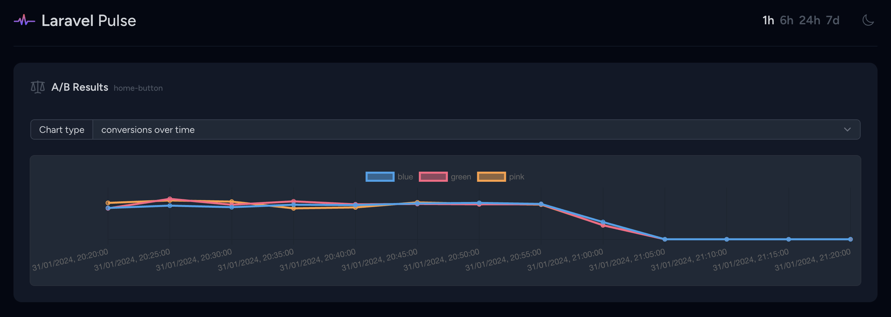

# Flagpost

Flagpost is a package that integrates with Laravel & Laravel Pennant to slightly enhance the basic A/B testing capabilities and lets you setup goals and track "conversion" rates.

## Installation

Install Flagpost into your project:
```bash
composer require bastuijnman/flagpost
```

When installed make sure you run the migrations to make sure conversions can be tracked in your database.
```bash
php artisan migrate
```

## Usage

After defining your Laravel Pennant features you can track user conversions with them by using the `Goal` facade. Flagpost aims to follow a similar interface to pennant, so in order to track a goal you would simply do

```php
<?php
 
namespace App\Http\Controllers;
 
use Illuminate\Http\Request;
use Illuminate\Http\Response;
use Laravel\Pennant\Feature;
use Bastuijnman\Flagpost\Goal;
 
class PodcastController
{
    /**
     * Display a listing of the resource.
     */
    public function index(Request $request): Response
    {
        return Feature::active('new-api')
                ? $this->resolveNewApiResponse($request)
                : $this->resolveLegacyApiResponse($request);
    }

    public function listen(Request $request): Response
    {
        Goal::reached('new-api');
        // Return response
    }
 
    // ...
}
```

Which would mean that once you start listening a podcast you'd have reached the goal of your feature.

### Scopes
Just like with Pennant you can specify the scope of your feature by doing

```php
Goal::for($team)->reached('billing-v2');
```

If you've defined a different Pennant default scope Flagpost should pick this up by default.

### Results

Flagpost allows you to grab the results of your Pennant features through the following methods:

```php
$results = Goal::results('purchase-button');
/*
 * 
 * [ 
 *   [ 'value' => 'total', 'converted' => 39 ], 
 *   [ 'value' => 'blue-sapphire', 'converted' => 17 ], 
 *   [ 'value' => 'seafoam-green', 'converted' => 13 ],
 *   [ 'value' => 'tart-orange', 'converted' => 9 ] 
 * ]
 * 
 */
```

You can also retrieve timeseries data by doing the following:

```php
$timeseries = Goal::timeseries('purchase-button', CarbonInterval::hour());
/*
 * 
 * [
 *   'blue-sapphire' => [
 *     [ 'time' => 1706706000, 'converted' => 3 ],
 *     [ 'time' => 1706706300, 'converted' => 2 ],
 *     [ 'time' => 1706706600, 'converted' => 0 ],
 *     ...
 *   ],
 *   'seafoam-green' => [
 *     [ 'time' => 1706706000, 'converted' => 1 ],
 *     [ 'time' => 1706706300, 'converted' => 3 ],
 *     [ 'time' => 1706706600, 'converted' => 2 ],
 *     ...
 *   ],
 *   'tart-orange' => [
 *     [ 'time' => 1706706000, 'converted' => 0 ],
 *     [ 'time' => 1706706300, 'converted' => 2 ],
 *     [ 'time' => 1706706600, 'converted' => 5 ],
 *     ...
 *   ],
 * ]
 * 
 */
```

#### Pulse
Flagpost ships with a card for Pulse by default, if your application has installed Pulse you can configure a feature card as follows:

```jsx
<livewire:flagpost.results cols="full" feature="home-button" />
```

It will render a card that allows you to either view the total results or in a timeseries based on the selected period.



## Testing

After cloning the repo and doing `composer install` you can run

```bash
./vendor/bin/phpunit
```

To run the test suite
